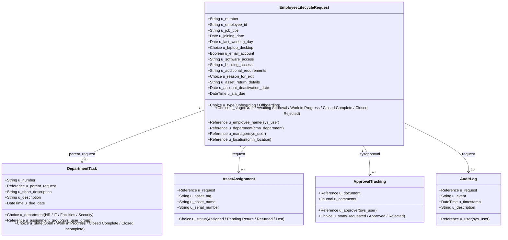

# Technical Design: Automated Employee Onboarding & Offboarding System in ServiceNow

This document outlines the database schema, scripting structures, and automation workflows designed for the ServiceNow Employee Lifecycle System.

---

## 1. Database Schema (Custom Tables)

To manage lifecycle requests, tasks, and historical compliance logs, five custom tables are implemented:



---

## 2. Catalog Client Scripts & UI Policies

### Client Scripts
1. **Validate Joining Date**:
   * **Table**: `u_employee_lifecycle_request`
   * **UI Type**: All
   * **Type**: `onChange` (Field: `u_joining_date`)
   * **Logic**: Prevents submittal of onboarding requests with a start date in the past. Alerts user and clears field if rule is violated.
2. **Validate Exit Date**:
   * **Table**: `u_employee_lifecycle_request`
   * **UI Type**: All
   * **Type**: `onChange` (Field: `u_last_working_day`)
   * **Logic**: Prevents submittal of offboarding requests with exit dates before current date.
3. **Auto-Populate Employee Details**:
   * **Table**: `u_employee_lifecycle_request`
   * **UI Type**: All
   * **Type**: `onChange` (Field: `u_employee_name`)
   * **Logic**: Uses a Client Callable Script Include (`UserLifecycleUtil`) via `GlideAjax` to auto-populate employee ID, current department, location, and manager to streamline forms.

### UI Policies
1. **Onboarding Fields Visibility**:
   * **Condition**: `u_type == 'Onboarding'`
   * **Action**: Set fields visible and mandatory: `u_joining_date`, `u_location`, `u_laptop_desktop`. Hide `u_reason_for_exit`, `u_asset_return_details`, `u_account_deactivation_date`.
2. **Offboarding Fields Visibility**:
   * **Condition**: `u_type == 'Offboarding'`
   * **Action**: Set fields visible and mandatory: `u_last_working_day`, `u_reason_for_exit`, `u_asset_return_details`. Hide `u_joining_date`, `u_laptop_desktop`, etc.

---

## 3. Server-Side Automations (Business Rules & Flow Designer)

### Business Rules
1. **Set Request SLA Target** (`before insert`):
   * **Logic**: Triggers on ticket insert. Calculates the dynamic overall SLA due date: 24h before joining date (onboarding) or 24h before last working day (offboarding). Sets `u_sla_due` accordingly.
2. **Close Request on Tasks Complete** (`after update`):
   * **Condition**: `State changes to Closed Complete` on `u_department_task`
   * **Logic**: Queries sibling tasks for the parent. If all tasks are resolved (state matches Closed Complete or Closed Incomplete), automatically sets the parent Lifecycle Request stage to `Closed Complete` and writes a work note.
3. **Audit Log Logger** (`after insert / update`):
   * **Logic**: Automatically monitors parent requests. Writes event records into `u_lifecycle_audit_log` on status transitions or approvals.

### Flow Designer Flows

#### Onboarding Workflow Flow:
1. **Trigger**: Record created in `u_employee_lifecycle_request` table where `Stage == Awaiting Approval` and `Type == Onboarding`.
2. **Action 1 (Approval)**: Ask for Approval from `u_manager`.
   * *If Rejected*:
     * Update request Stage to `Closed Rejected`.
     * Create Audit Log.
     * Send email notification: `Approval Rejected`.
     * End Flow.
   * *If Approved*:
     * Update request Stage to `Work in Progress`.
     * Create Audit Log.
3. **Action 2 (Parallel Task Creation)**:
   * Create HR task `TSKxxx`: Profile & Documentation Setup (SLA: 2 Days).
   * Create IT task `TSKxxx`: Setup User AD account, email, and provision `u_laptop_desktop` (SLA: 2 Days).
   * Create Facilities task `TSKxxx`: Workspace cubicle allocation (SLA: 2 Days).
   * Create Security task `TSKxxx`: RFID access card badge issuance (SLA: 1 Day).
4. **Action 3 (Wait)**: Wait for all created tasks to transition to a closed state.
5. **Action 4 (Closure)**: Mark request `Closed Complete`, send notification to manager.

#### Offboarding Workflow Flow:
1. **Trigger**: Record created where `Stage == Awaiting Approval` and `Type == Offboarding`.
2. **Action 1 (Approval)**: Ask for Manager approval.
3. **Action 2 (Parallel Revocation & Recoveries)**:
   * Create IT task: Revoke AD account, disable email, retrieve physical laptop (SLA: 2 Days).
   * Create Security task: Disable building RFID access badge (SLA: 1 Day).
   * Create HR task: Process final paycheck, cancel benefits, archive record (SLA: 2 Days).
4. **Action 3 (Wait)**: Wait for tasks completion.
5. **Action 4 (Closure)**: Archive user record (`sys_user.active = false`) and mark parent request `Closed Complete`.

---

## 4. Role-Based Access Control (ACLs)

Role security enforces data confidentiality and task ownership constraints:

| Role | Read Requests | Write Requests | Complete Tasks | Access Sensitive Fields |
| :--- | :---: | :---: | :---: | :---: |
| **HR Admin** | Yes (All) | Yes (All) | Yes (All) | Yes |
| **Manager** | Yes (Self/Team) | No (Read-Only) | No | Yes (Basic fields) |
| **Employee** | Yes (Self-only) | No | No | No (Read-only own details) |
| **IT Support** | Yes (Assigned Task) | Task Only | IT Tasks | IT Fields only |
| **Facilities Team** | Yes (Assigned Task) | Task Only | Facilities Tasks | Facilities Fields only |
| **Security Team** | Yes (Assigned Task) | Task Only | Security Tasks | Security Fields only |

*   **Security Script ACL logic on Request**:
    ```javascript
    if (gs.hasRole('admin') || gs.hasRole('u_hr_admin')) {
        answer = true;
    } else if (gs.getUserID() == current.u_employee_name || gs.getUserID() == current.u_manager) {
        answer = true;
    } else {
        // Grant read access only if the user belongs to the group of an active child task
        var taskGr = new GlideRecord('u_department_task');
        taskGr.addQuery('u_parent_request', current.sys_id);
        taskGr.addQuery('u_assignment_group', 'javascript:getMyGroups()');
        taskGr.query();
        answer = taskGr.hasNext();
    }
    ```

---

## 5. SLA Management & Notification Mappings

### SLA Engine Map:
*   **Manager Approval SLA**: 24 Hours (Stop: Approval state changes).
*   **HR Tasks**: 2 Days (Stop: Task closes).
*   **IT Tasks**: 2 Days (Stop: Task closes).
*   **Facilities Tasks**: 2 Days (Stop: Task closes).
*   **Security Tasks**: 1 Day (Stop: Task closes).
*   **Overall Onboarding**: Must close prior to `Joining Date`.
*   **Overall Offboarding**: Must close prior to `Last Working Day`.

### Email Notifications Matrix:
1. **Request Submitted**: Sent to Manager and Employee upon record insertion.
2. **Approval Required**: Sent to Manager containing approval link & details.
3. **Approval Granted**: Sent to Employee/HR notifying them that provisioning has begun.
4. **Approval Rejected**: Sent to Employee detailing why the request was declined.
5. **Task Assigned**: Sent to respective department group (IT/HR/Facilities/Security).
6. **Task Completed**: Sent to HR Admin to log progress tracker.
7. **SLA Warning**: Sent to Assignment Group manager when task reaches 75% elapsed SLA duration.
8. **Request Closed**: Sent to Employee and Manager welcoming the new hire or confirming deactivation.
